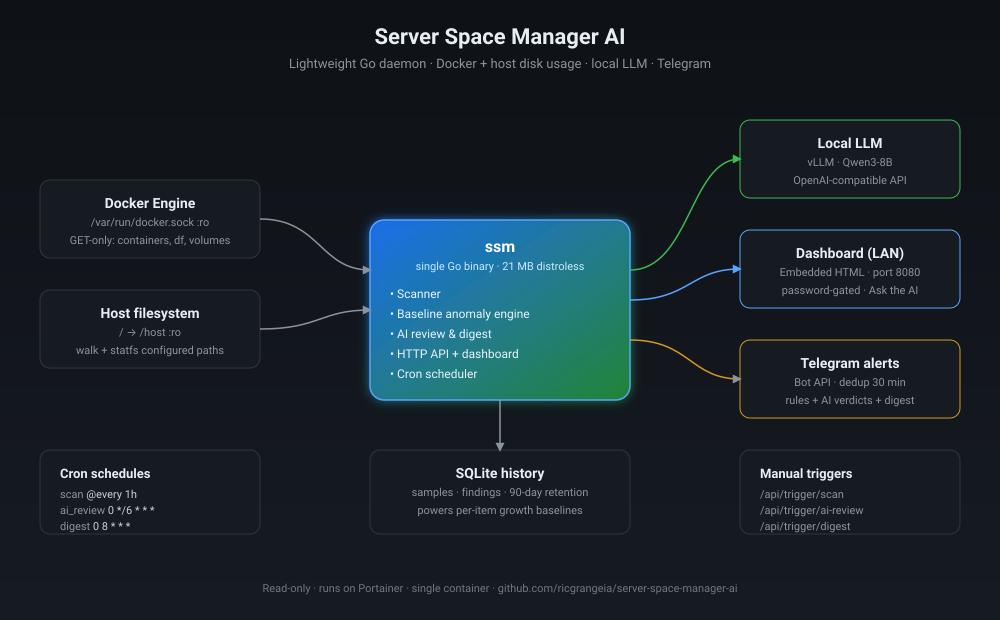

# Server Space Manager

A small, long-running Go daemon that watches disk usage on a Docker host —
containers, logs, volumes, images, bind mounts, and arbitrary host paths —
and lets you ask a **local LLM** (vLLM, Ollama, anything OpenAI-compatible)
what to clean up. Threshold breaches can fan out to **Telegram**.

Built to live on a Portainer git stack, alongside your existing vLLM.

> **Status:** early. The API and config shape may still change before `v1.0`.

---

## Features

- **Read-only by design.** The manager never deletes, rotates, or modifies
  anything. It reports; you act.
- **Docker-aware.** Container log sizes, bind-mount sizes, per-volume usage
  (including orphaned volumes), per-image footprint, all via a read-only
  socket proxy.
- **Host-aware.** Configurable filesystem walks with depth caps and ignore
  globs. Per-mountpoint capacity tracking via `statfs`.
- **Trend history.** Every scan is persisted to SQLite (pure Go, no CGO);
  growth-since queries power "what blew up this week?" alerts.
- **Local LLM Q&A.** The dashboard's *Ask the AI* panel forwards a compact
  snapshot to your local model and shows the answer. Snapshot is pre-
  aggregated to top-N per kind so it fits comfortably in an 8k context.
- **AI review on a cron.** Periodically (default every 6h), the model is shown
  recent growth trends, **per-item baseline anomalies** (last-24h growth vs
  that item's own 7-day average), and the filesystem capacity table, then
  asked to nominate items worth alerting on — the things static thresholds
  miss. Output is constrained to JSON whose keys must exist in the snapshot,
  so hallucinated container/volume names are dropped.
- **Baseline anomaly detection.** SQLite tracks per-item growth, so the
  system knows each container's, volume's, and folder's *normal* daily rate.
  When something spikes to >=3× its own baseline (and the delta is non-
  trivial), it's surfaced — without needing a hand-tuned threshold per item.
- **Daily AI digest** — one short Telegram message per day summarising the
  last 24h of growth, written by the model.
- **Cron-driven scheduler.** All periodic jobs (scan, AI review, digest)
  are declared as cron expressions in `config.yaml` — no external scheduler
  needed.
- **Telegram alerts** with per-key dedup (30 min default) and a per-scan
  *rollup* for orphan volumes — "🧹 23 orphan volumes — 4.2 GB total"
  instead of one ping per item.
- **End-of-scan reports on Telegram** for cron and manual scans alike,
  with the top filesystems, container logs, volumes and active alerts.
  Mute with a single config flag.
- **Biggest files** card on the dashboard — top N largest individual files
  across all configured paths. Good for spotting leaked core dumps and
  unrotated logs.
- **Findings panel** unifying AI-review verdicts and rule-engine alerts
  from the last 7 days, with source/severity badges and a filter.
- **Single-password dashboard** with random-token session cookies, baseline
  security headers, and rate-limited `/api/ask`. LAN-only by design.
- **Lightweight.** ~21 MB static binary, distroless runtime image, no CGO.

## Architecture



```text
            ┌────────────────────┐
            │  Portainer stack   │
            └─────────┬──────────┘
                      │
   ┌──────────────────┴──────────────────┐
   │                                     │
   │   ┌──────────┐     ┌────────────┐   │     ┌──────────┐
   │   │   ssm    │────▶│ socket-    │───┼────▶│  docker  │
   │   │ (Go bin) │     │  proxy     │   │     │  daemon  │
   │   └────┬─────┘     └────────────┘   │     └──────────┘
   │        │                            │
   │        ├──── /host:ro ─── host filesystem (read-only bind)
   │        │
   │        ├──── HTTP ──▶ vllm (Qwen 3 8B, your network)
   │        │
   │        └──── HTTP ──▶ Telegram Bot API
   │
   └─────────────────────────────────────┘
```

## Quick start (Portainer git stack)

1. **Create the shared network** on your host (one-time):

   ```sh
   docker network create ai-network
   ```

   Make sure your vLLM container joins this network too.

2. **Copy `config.example.yaml` to `config.yaml`** in this repo and edit it.
   At minimum: set `http.password`, point `llm.base_url` at your vLLM, and
   (optionally) fill in `telegram.bot_token` / `chat_id`.

3. **Add a git stack in Portainer** pointing at this repo. Set stack env
   vars as needed:

   | Variable        | Default                                         | Purpose                                    |
   | --------------- | ----------------------------------------------- | ------------------------------------------ |
   | `SSM_IMAGE`     | `ghcr.io/ricgrangeia/server-space-manager-ai:latest` | Image to pull (override or use `build:`) |
   | `SSM_PORT`      | `8080`                                          | Host port for the dashboard                |
   | `VLLM_NETWORK`  | `ai-network`                                      | External network with your vLLM container  |

4. **Deploy.** Visit `http://<host>:8080`, log in with the password from
   `config.yaml`.

## Configuration

See [`config.example.yaml`](config.example.yaml) — every key is documented inline.

Key sections:

- `scan_interval` / `retention_days` — how often to scan and how long to keep
  history in SQLite.
- `docker.*` — which Docker objects to track. Talks to `socket-proxy`.
- `host_paths` — directories to walk on the host (mounted at `/host` inside
  the container). Each entry has `max_depth` and optional `alert_growth_pct`.
- `filesystems` — mount points to track capacity (statfs) for.
- `llm.*` — OpenAI-compatible endpoint for `/api/ask`.
- `telegram.*` — bot token + chat ID for push alerts.
- `alerts.*` — thresholds (`fs_warn_pct`, `fs_crit_pct`, `big_item_mb`,
  `growth_pct`).
- `http.password` — single shared dashboard password. Empty disables auth.

## HTTP API

| Endpoint        | Method | Auth | Purpose                                            |
| --------------- | ------ | ---- | -------------------------------------------------- |
| `/`             | GET    | ✓    | Embedded dashboard                                 |
| `/login`        | GET/POST | –  | Password form / cookie issue                       |
| `/logout`       | GET    | –    | Clears the auth cookie                             |
| `/healthz`      | GET    | –    | Liveness — returns `{status, version}`             |
| `/api/summary`  | GET    | ✓    | Latest snapshot (top-N per kind, filesystem %s)    |
| `/api/findings` | GET    | ✓    | Last 7 days of findings; `?source=rules\|ai_review` |
| `/api/ask`      | POST   | ✓    | `{question}` → LLM answer (rate-limited)            |
| `/api/trigger/scan`      | POST | ✓ | Run a scan on demand                                |
| `/api/trigger/ai-review` | POST | ✓ | Run the AI review on demand                         |
| `/api/trigger/digest`    | POST | ✓ | Send the daily AI digest on demand                  |

## Security model

**Mount layout**

- Docker socket mounted **read-only** at `/var/run/docker.sock:ro`. The Go
  HTTP client only ever issues `GET` requests against four endpoints
  (`/containers/json`, `/containers/{id}/json`, `/system/df`, `/volumes`).
  The read-only mount blocks Engine API writes at the kernel level even if
  the code were rewritten to attempt them.
- Host filesystem mounted **read-only** at `/host:ro`.
- The container's only writable surface is its own named volume `ssm-data`
  (holds the SQLite DB). No write access to the host or to Docker.

**Authentication & transport**

- Dashboard login uses a shared password. On success the server mints a
  **32-byte random session token** (HttpOnly, SameSite=Strict cookie); the
  password itself never lives in the cookie. Sessions are kept in memory,
  expire after 30 days, and are invalidated on logout or process restart.
- All responses carry baseline security headers: `X-Content-Type-Options:
  nosniff`, `X-Frame-Options: DENY`, `Referrer-Policy: no-referrer`, and a
  CSP that blocks cross-origin scripts/styles and iframe embedding.
- `/api/ask` is rate-limited (token bucket: 5 burst, refill 1 every 10 s)
  so a single tab can't saturate the local LLM.
- No TLS on `:8080` — front with a reverse proxy if you need remote access.

**Image & runtime**

- Distroless base — no shell, no package manager, no busybox. Single static
  Go binary, ~21 MB total image size.
- Container runs as root **only because** `/var/run/docker.sock` is owned by
  `root:docker` on the host. The read-only mounts and absence of a shell
  keep the blast radius minimal even with elevated UID.
- `no-new-privileges:true` set in compose.

**Defence in depth (optional)**

If you want a hard policy boundary in front of the Docker socket, put
`tecnativa/docker-socket-proxy` or `wollomatic/socket-proxy` in front and
set `docker.host: "tcp://socket-proxy:2375"` in the config.

**Caveat**

The single-password gate is a convenience barrier for a trusted LAN, not a
real identity system. Do not expose port 8080 to the public internet
directly.

## Building locally

```sh
go mod tidy
go build -o bin/ssm ./cmd/ssm
./bin/ssm -config ./config.yaml -db ./data/ssm.db
```

Docker build:

```sh
docker build \
  --build-arg VERSION=$(git describe --tags --always) \
  --build-arg COMMIT=$(git rev-parse --short HEAD) \
  --build-arg BUILD_DATE=$(date -u +%Y-%m-%dT%H:%M:%SZ) \
  -t server-space-manager-ai:dev .
```

## Author

Ricardo Grangeia — Software Engineer — Portugal

[](https://ricardo.grangeia.dias)
[](mailto:ricardo@grangeia.pt)

---


## Versioning

Semantic versioning. Pre-1.0 releases may break config or API.
See [`CHANGELOG.md`](CHANGELOG.md).

## License

[MIT](LICENSE) © Ricardo Grangeia
